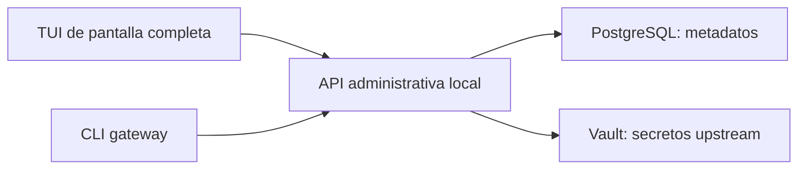

# Diseño: TUI y CLI para administrar el gateway

Fecha: 2026-09-28
Estado: propuesta para revisión del usuario

## Objetivo

Hacer que la administración del gateway sea fácil de recorrer y entender desde una terminal. La interfaz debe conservar el estilo de una herramienta Linux, con navegación por teclado, aspecto sobrio y ayuda visible. Además de la TUI, el proyecto ofrecerá comandos repetibles y una salida JSON para automatización.

El usuario confirmó que deben mejorarse las tres áreas: descubrir acciones, entender las relaciones entre recursos y completar/corregir formularios. También eligió una TUI de pantalla completa y cobertura CLI para todas las áreas.

## Alcance

- Reemplazar la secuencia plana de preguntas de Inquirer con una TUI de pantalla completa.
- Añadir un CLI con operaciones para todas las áreas administrativas actuales: aplicaciones, emisores JWT, proveedores, rutas, accesos, orígenes, credenciales, claves de acceso, importación OpenAPI y auditoría.
- Mantener Hono, PostgreSQL y Vault como backend y almacenes actuales.
- Mantener la interfaz dentro de la terminal; no añadir una interfaz web.
- Conservar los lanzadores de Windows/WSL documentados por el proyecto.

## Experiencia de la TUI

### Navegación

- Pantalla inicial con el estado del backend y resúmenes de aplicaciones, proveedores y rutas.
- Navegación agrupada por área, con selección persistente y una ruta visible de ubicación.
- En cada área, presentar una lista de recursos y el detalle del elemento seleccionado, con enlaces a sus relaciones relevantes. Por ejemplo, un proveedor debe permitir llegar a sus rutas y credenciales; una aplicación, a sus claves y accesos.
- Mantener visibles las acciones disponibles en una barra inferior: Atrás, Avanzar, Crear, Editar, Guardar, Cancelar y Ayuda, según corresponda.
- Atrás/Avanzar recorre el historial de pantallas mientras exista historial; en formularios por pasos, Avanzar lleva al siguiente paso validado. Volver atrás conserva los valores del formulario.
- `Esc` vuelve o cancela, `Enter` confirma la acción enfocada, las flechas recorren opciones y `?`/`F1` muestra atajos y ayuda contextual.
- Confirmar explícitamente las operaciones destructivas. Al guardar cambios importantes, mostrar un resumen de lo que se aplicará.

### Diseño visual y formularios

- Usar paneles y separadores con moderación, tipografía de terminal y una paleta sobria con un solo color de acento.
- No depender únicamente del color para comunicar selección, estado activo, error o advertencia; acompañarlo con texto e iconos o marcadores claros.
- En terminales anchas, mostrar navegación, lista y detalle en paneles. En terminales estrechas, apilar esos paneles y permitir desplazarse por ellos sin perder la ubicación.
- Agrupar formularios por tema, indicar campos obligatorios y opcionales, validar junto al campo y conservar los valores al volver atrás.
- Mostrar errores en contexto con una acción de recuperación clara, sin borrar el formulario ni la entrada del usuario.

## Interfaz CLI

Un ejecutable `gateway` expondrá `gateway tui` y comandos con la forma `gateway <area> <action>`. Los nombres de áreas coincidirán con los de la TUI. Ejemplos ilustrativos:

```text
gateway tui
gateway applications list
gateway providers create
gateway credentials create
gateway api-keys revoke
gateway audit list --json
```

- Cada área tendrá `--help` con sus operaciones y opciones disponibles.
- La salida predeterminada será una tabla legible; `--json` devolverá metadatos estructurados para scripts.
- En modo no interactivo, `--input-json` leerá de `stdin` un objeto con los datos de la operación y, cuando haga falta, la contraseña administrativa o el secreto. Los valores sensibles no se aceptarán como argumentos ni se escribirán en logs.
- Las operaciones de escritura cubrirán las capacidades administrativas de cada recurso, incluidas las acciones particulares como importar OpenAPI, revocar claves y activar/desactivar recursos.
- Las eliminaciones pedirán confirmación en terminal interactiva. `--yes` habilitará su uso deliberado en scripts.
- El CLI usará la misma API administrativa local y validaciones que la TUI; no hablará directamente con PostgreSQL ni con Vault.

## Sesiones, credenciales y claves

- Ambas interfaces se conectarán solo al backend de loopback y usarán la ruta actual de sesión administrativa.
- La TUI pedirá la contraseña de administración una vez por sesión y conservará el token solo en memoria hasta salir o hasta que venza.
- Cada invocación de una sola acción del CLI pedirá la contraseña de administración sin mostrarla. Para uso no interactivo, `--input-json` leerá la contraseña desde `stdin`; no habrá una opción que reciba su valor como argumento ni se guardará el token en disco.
- La creación de una credencial upstream usará una entrada oculta o `--input-json` desde `stdin`. Nunca aceptará el secreto como argumento de línea de comandos. La salida y los listados mostrarán solo metadatos, nunca el secreto.
- Las credenciales upstream seguirán almacenándose en Vault. Si Vault no está disponible, la operación fallará de forma cerrada y explicará cómo recuperar el servicio.
- Las claves del gateway se seguirán generando en el servidor. El valor completo aparecerá una sola vez tras crearlas; PostgreSQL conservará solo el hash y los metadatos. El CLI podrá emitir el valor una vez en la respuesta JSON de creación para que el usuario lo capture intencionalmente.
- La TUI y el CLI mostrarán mensajes en español para sesión vencida, backend inaccesible, errores de validación, Vault sellado/no disponible, permisos insuficientes y operaciones destructivas pendientes.

## Arquitectura y límites



La API existente será la única frontera de administración. Donde falte una operación necesaria para que ambas interfaces tengan cobertura equivalente, se añadirá una ruta administrativa validada y limitada a loopback; los clientes no implementarán lógica distinta para el mismo cambio de datos.

## Criterios de aceptación

- Las diez áreas administrativas pueden abrirse y gestionarse desde la TUI sin recorrer un menú plano de preguntas para cada acción.
- El usuario puede volver y avanzar por el historial y los pasos de formulario sin perder datos sin guardar.
- Los detalles muestran relaciones entre recursos y ofrecen accesos directos a los recursos relacionados.
- La TUI sigue siendo usable en terminales estrechas, con o sin color.
- El CLI ofrece comandos para todas las áreas, `--help`, tablas legibles y JSON estructurado.
- La TUI y el CLI aplican las mismas validaciones y autorizaciones porque comparten la API administrativa.
- Las credenciales no aparecen en argumentos, historial, listados, JSON de metadatos ni logs. Las claves recién generadas se muestran una sola vez.
- Las operaciones destructivas requieren confirmación interactiva salvo que se indique `--yes`.
- Los fallos de backend, PostgreSQL o Vault informan la acción siguiente y no muestran secretos.

## Riesgos y decisiones pendientes de implementación

- La TUI actual depende de Inquirer; una interfaz persistente de paneles requerirá reemplazar esa capa de interacción por un renderizador de terminal de pantalla completa.
- Las APIs administrativas actuales no necesariamente exponen todas las mutaciones que una administración completa necesita. El plan de implementación deberá mapear cada operación a las rutas existentes y añadir solo las que falten.
- El entorno Windows/WSL tiene que conservar un tamaño de terminal válido y las entradas de teclado deben comportarse de forma coherente en ambas plataformas.
- El diseño interpreta “estilo Linux” como navegación de teclado, paneles sobrios y ayuda contextual; no como copiar la apariencia de una distribución específica.

## Verificación propuesta

La revisión de implementación debe recorrer las tareas habituales desde ambos clientes: crear y encontrar una aplicación, configurar un proveedor y una credencial, enlazar rutas/accesos, recuperar un error de validación, cancelar una eliminación y generar/revocar una clave. También debe comprobar el comportamiento en terminal estrecha, backend inaccesible, sesión vencida y Vault no disponible, sin usar credenciales reales en fixtures.
